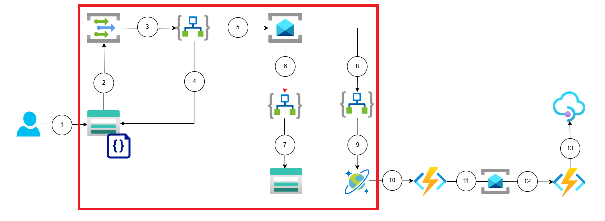
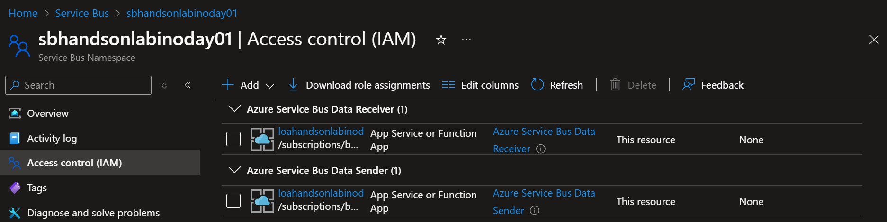
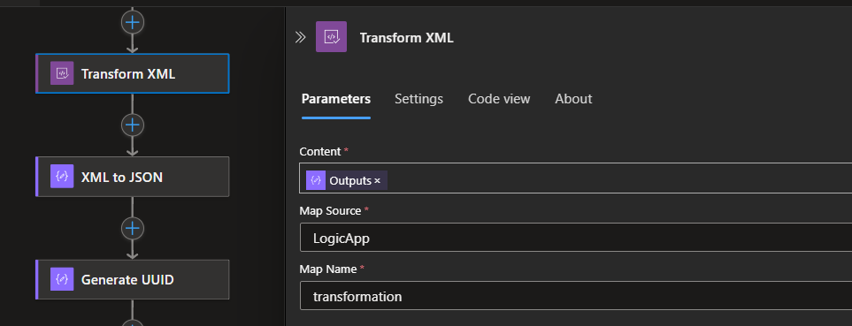
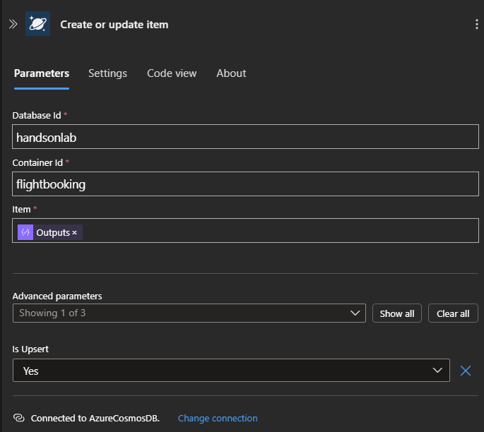

# Introduction

Welcome to this Azure iPaaS Workshop. You'll be experimenting with multiple integration services to build an event-driven data processing application.

You should ideally have a basic understanding of Azure, but if not then do not worry, you will be guided through the whole process.

During this workshop you will have the instructions to complete each steps. The solutions are placed under the 'Toggle solution' panel.

<div class="task" data-title="Task">

> - You will find the instructions and expected configurations for each Lab step in these yellow **TASK** boxes.
> - Log into your Azure subscription on the [Azure Portal](https://portal.azure.com) using the credentials provided to you.

</div>

In this lab, you are going to reproduce a real life scenario from a e-commerce platforms, when orders are passed by customers and when you need to process them, ideally asynchronously. You are going to leverage some Azure Services tailored to simplify this integration.

TODO: mettre le schema drawio quand revu par Iheb

## Tooling and services

- **Azure Logic Apps**: A cloud service that helps you automate workflows and integrate apps, data, and services.
- **Azure Functions**: A serverless compute service that allows you to run event-driven code without managing infrastructure.
- **Azure Service Bus**: A messaging service that enables reliable communication between distributed applications and services.
- **azd** (Azure Developer CLI): `azd` is a command-line interface designed to simplify the deployment and management of applications on Azure. It provides a unified experience for developers to build, deploy, and monitor their applications using a set of easy-to-use commands. With `azd`, you can streamline your workflow, automate repetitive tasks, and ensure consistent deployments across different environments.
- **GitHub Codespace**: GitHub Codespaces provides a cloud-based development environment that allows you to code, build, test, and collaborate from anywhere. It offers a fully configured development environment that can be accessed directly from your browser or through Visual Studio Code. With Codespaces, you can quickly spin up a development environment with all the necessary tools and dependencies, ensuring a consistent setup across your team.

You will require a tool to send HTTP requests without coding such as [Postman](https://www.postman.com/), [Bruno](https://www.usebruno.com/) or [VSCode thunder](https://www.thunderclient.com/).

## Prepare your dev environment

<div class="task" data-title="Task">
You have a fork the GitHub project in order to have you own copy that you can keep and edit. You could clone it locally but we will leverage GitHub Codespaces

</div>

<details>

<summary> Toggle solution</summary>

1- Open a browser and go the [lab repository](https://github.com/ikhemissi/azure-ipaas-workshop/)

2- Click on `Code`, then `Codespaces` and on the button `Create codespace on main`.


3- It should open a new tab in your browser with a full editor and a terminal from where you are going to continue the lab. It can take few minutes because Codespace create a container (kind of virtual machine) and installs a lot of tools on it

</details>

### Provision resources in Azure

<div class="task" data-title="Task">

> - Use `azd` to provision resources in Azure and deploy provided applications. You can use the `azd up` command, once logged in to Azure in your terminal.

</div>

<details>

<summary> Toggle solution</summary>

```sh
# Log into azd
azd auth login

# Provision resources and deploy applications
azd up
```

</details>

### Validate the setup on Azure

The provisioning step may take few minutes. Once it finishes you should have a resource group containing all resources needed in this workshop.

Moreover, you some of the applications (e.g. Azure Functions) should also be deployed and ready to be used.

<div class="task" data-title="Task">

> - Open the Azure Portal and ensure that you can see a resource group with various iPaaS resources
> - Ensure that there are no failed deployments

</div>

<details>

<summary> Toggle solution</summary>

You terminal should show green messages such as:


In the Azure portal, you should have a new resource group with a lot of sub resources inside it.


</details>

---

# Lab 1 : Process and Transform a file (1 hour)

For this first lab, you will focus on the following scope :



## Detect a file upload event (15 min)

### Secure connections between Azure Services with Managed Identities

Managed Identities in Azure allow resources to authenticate securely to other Azure services. This feature eliminates the need to manage secrets or keys, reducing the risk of accidental exposure and simplifying maintenance. By enabling seamless and secure communication between resources, Managed Identities promote a stronger security model that relies on Azure's identity platform for authentication.

<div class="info" data-title="Note">

> You can find a detailed article which explains what are managed identities for Azure resources and how to use them [following this link](https://learn.microsoft.com/en-us/entra/identity/managed-identities-azure-resources/overview).

</div>

### Event Services

Serverless is all about designing the application around event-driven architectures. Azure offers several options when it comes to message and event brokering, with the principal following services :

- Event Grid is a serverless eventing bus that enables event-driven, reactive programming, using the publish-subscribe model.
- Service Bus is a fully managed enterprise message broker with message queues and publish/subscribe topics.
- Event Hub is a big data streaming platform and event ingestion service. It can receive and process millions of events per second.

<div class="info" data-title="Note">

> Each of these services offer their own set of capabilities and will be preferred depending on the expected architecture design and requirements. You can find a detailed article which compares the pros and cons of each of these solutions [following this link](https://learn.microsoft.com/en-us/azure/service-bus-messaging/compare-messaging-services).

</div>

Event Grid is an event broker that you can use to integrate applications while subscribing to event sources. These events are delivered through Event Grid to subscribers such as applications, Azure services, or any accessible endpoint. Azure services, First and Third-party SaaS services as well as custom applications can be the source of these events.

### Check Logic App permission to access Event Grid

Event Grid enables event-driven automation by reacting to changes in Azure resources, such as triggering workflows or functions when a blob is uploaded to Azure Blob Storage.
This simplifies integration and real-time processing across services without constant polling.
You will use it to trigger the Logic App workflow `wf_flightbooking_from_sa_to_sb` when a blob is uploaded in the `inputfiles` container of the Storage Account.

The Logic App needs to access the Event Grid service through the Storage Account as it will create an Event Grid System Topic when the Event Grid trigger connector is created. Since we want to use Managed Identities to secure the connection between our Azure Resources, let's check how it is configured in the Storage Account.

<div class="task" data-title="Tasks">

>- Check that correct RBAC configuration is applied in the Storage Account `stdatalabnoipa[randomid]`.

</div>

<details>

<summary> Toggle solution</summary>

>- Navigate to the Storage Account `stdatalabnoipa[randomid]`.
>- In the left-hand menu, click on `Access Control (IAM)`.
>- From the top-menu bar, click on Role Assignment and check that Logic App `loahandsonlabinoday01` has the **Event Grid Contributor** role.

You should see the following RBAC configuration in your Storage Account :


</details>

### Check the Event Grid trigger in Logic App

Next step is to actually trigger the Logic App `loahandsonlabinoday01` based on the event raised by your Event Grid System Topic when a file is uploaded to the `inputfiles` container.

Azure Logic Apps offers different components which can be used to define the steps of a flow as a chain of actions and controls. Here are the main ones :

- **Operations** : Triggers and Actions are the main building blocks of a Logic App. A trigger is the event that starts the workflow and an action is a step in this workflow.
- **Controls** : Switch, Loop, Condition, Scope are used to control the flow of the steps composing the actual logic of the workflow.
- **Connectors** : Connectors are used to connect to different first of third party services and applications. These connectors abstract the complexities of interacting with these services by defining their required and optional inputs as well as deserializing their outputs to dynamic objects usable in the rest of the flow steps.

Since we want the Logic App to be triggered when an event is pushed from the Event Grid System Topic, we will be using the Event Grid Built-In connector available in Logic App.
It comes with one action "When a resource event occurs", that is triggered when an Azure Event Grid subscription fires an event.

<div class="task" data-title="Tasks">

>- Check the configuration of the Event Grid trigger in the Logic App `loahandsonlabinoday01` workflow `wf_flightbooking_from_sa_to_sb`.

</div>

<details>

<summary> Toggle solution</summary>

>- Navigate to the Logic App `loahandsonlabinoday01`.
>- In the left-hand menu, click on `Workflows` from the `Workflows` section.
>- Open the workflow `wf_flightbooking_from_sa_to_sb`.
>- In the left-hand menu, click on `Designer` from the `Developer` section.
>- Click on the trigger `When a resource event occurs`
>- Make sure that the Resource Id corresponds to your Storage Account where the file will be uploaded and that the Event type is **Microsoft.Storage.BlobCreated**

You should see the following RBAC configuration in your Storage Account :


</details>

### Check the Event Grid subscription in the Event Grid System Topic

When we save the workflow for the first time, an Event Grid subscription will be created in the Storage Account automatically with some default naming convention, and it will be in 'Creating' state.
We will see in the next step why and how to validate the subscription.
In the meatime, let's have a look to the Event Grid subscription.

<div class="task" data-title="Tasks">

>- Check the configuration of the Event Grid subscription in the Storage Account `stdatalabnoipa[randomid]`.

</div>

<details>

<summary> Toggle solution</summary>

>- Navigate to the Storage Account `stdatalabnoipa[randomid]`.
>- In the left-hand menu, click on Events.

You should see the following configurations in Event Grid Subscription :


</details>

<div class="task" data-title="Tasks">

> Check the configuration of the Event Grid subscription in the Storage Account `stdatalabnoipa[randomid]`.

</div>

<details>

<summary> Toggle solution</summary>

>- Click on the name of the Subscription on the bottom of the page.

You should see the following configurations in Event Grid Subscription :


</details>

### Check the Webhook validation condition

After the event is received, we add an action to parse the json event with the event grid schema. We can get the schema from [here](https://learn.microsoft.com/en-us/azure/event-grid/event-schema#event-schema).
The input to Parse JSON step is :

`@triggerBody()`

We add a condition step after, to check whether the event is a subscription Validation event or not. Condition is:

`"equals": [
          "@body('Parse_JSON')[0]?['eventType']",
          "Microsoft.EventGrid.SubscriptionValidationEvent"
        ]`

The reason we need to do this is to validate that our workflow is the correct subscriber to the events in the Storage Account. This is a security mechanism, to avoid untrusted subscribers to our Storage Account.  
Until we do not validate this event, the subscription will remain in the 'Creating' state.
To validate the event, we are using the Response action: `Response Validation Webhook`.

<div class="task" data-title="Tasks">

>- Check the configuration of the Condition action in the Logic App `loahandsonlabinoday01` workflow `wf_flightbooking_from_sa_to_sb`.

</div>

<details>

<summary> Toggle solution</summary>

>- Navigate to the Logic App `loahandsonlabinoday01`.
>- In the left-hand menu, click on `Workflows` from the `Workflows` section.
>- Open the workflow `wf_flightbooking_from_sa_to_sb`.
>- In the left-hand menu, click on `Designer` from the `Developer` section.
>- Click on the condition `Condition`

You should see the following configuration in your Condition :


</details>

## Process the event (5 min)

### Check Logic App permission to access Storage Account

The Storage Account is used to store data objects, including blobs, file shares, queues, tables, and disks. In our lab, it is used to store the sample flight booking JSON file inside an `inputfiles` container.

The Logic App needs to access the Storage Account to retrieve the JSON file, and for the Event Grid trigger connector to list the available Storage Accounts in the Subscription.
Since we want to use Managed Identities to secure the connection between our Azure Resources, let's check how it is configured in the Storage Account.

<div class="task" data-title="Tasks">

>- Check that correct RBAC configuration is applied in the Storage Account `stdatalabnoipa[randomid]`:

</div>

<details>

<summary> Toggle solution</summary>

>- Navigate to the Storage Account `stdatalabnoipa[randomid]`.
>- In the left-hand menu, click on `Access Control (IAM)`.
>- From the top-menu bar, click on Role Assignment and check that Logic App `loahandsonlabinoday01` has the **Storage Blob Data Contributor** role.

You should see the following RBAC configuration in your Storage Account :


</details>

### Retrieve file content

To retrieve the content of the file that will be uploaded in the `inputfiles` container, we are using the `Azure Blob Storage` connector and `Read blob content` action.

<div class="task" data-title="Tasks">

>- Check the configuration of the `Read blob content` action in Logic App `loahandsonlabinoday01` workflow `wf_flightbooking_from_sa_to_sb`:

</div>

<details>

<summary> Toggle solution</summary>

>- Navigate to the Logic App `loahandsonlabinoday01`.
>- In the left-hand menu, click on `Workflows` from the `Workflows` section.
>- Open the workflow `wf_flightbooking_from_sa_to_sb`.
>- In the left-hand menu, click on `Designer` from the `Developer` section.
>- Click on the action `Read blob content`.
>- Make sure that the Container Name is set to `inputfiles` and that the Blob Name is set to `last(split(items('For_each')['subject'], '/'))`.

You should see the following configuration in your action :


</details>

## Publish the message (10 min)

### Publish/Subscribe design pattern

The Publish/Subscribe (Pub/Sub) design pattern enables a decoupled communication model where publishers send messages to a central broker, and subscribers receive only the messages they are interested in, based on topics subscriptions.
This approach is well-suited for systems requiring loose coupling between components, such as event-driven architectures, when an application needs to broadcast information to multiple consumers, particularly if they operate independently, use different technologies, or have varying availability and response time requirements.

<div class="info" data-title="Note">

> You can find a detailed article which explains what is the Publisher-Subscriber design pattern and when to use it [following this link](https://learn.microsoft.com/en-us/azure/architecture/patterns/publisher-subscriber).

</div>


Azure Service Bus is a good solution for implementing the Publish/Subscribe pattern as it provides robust messaging capabilities, including topic-based subscriptions, reliable message delivery, and support for diverse protocols and platforms.
Its built-in features, such as message filtering, dead-letter queues, and transactional processing, make it ideal for building scalable, decoupled, and fault-tolerant systems.

### Check Logic App permission to access Service Bus

The Logic App needs to access the Service Bus to publish the message (content of the file). Since we want to use Managed Identities to secure the connection between our Azure Resources, let's check how it is configured in the Service Bus.

<div class="task" data-title="Tasks">

>- Check that correct RBAC configuration is applied in the Service Bus `sb-lab-no-ipa-[randomid]`:

</div>

<details>

<summary> Toggle solution</summary>

>- Navigate to the Service Bus `sb-lab-no-ipa-[randomid]`.
>- In the left-hand menu, click on `Access Control (IAM)`.
>- From the top-menu bar, click on Role Assignment and check that Logic App `loahandsonlabinoday01` has the **Service Bus Data Receiver** and **Service Bus Data Sender** roles.

You should see the following RBAC configuration in your Service Bus Namespace :



</details>

### Check the action to Publish the message to Service Bus

Next step is to publish the message (i.e. content of the file) in the Service Bus topic `topic-flighbooking`.
To do that, we are using the `Service Bus` connector and `Send message to a queue or topic` action.

<div class="task" data-title="Tasks">

>- Check the configuration of the `Send message to a queue or topic` action in Logic App `loahandsonlabinoday01` workflow `wf_flightbooking_from_sa_to_sb`:

</div>

<details>

<summary> Toggle solution</summary>

>- Navigate to the Logic App `loahandsonlabinoday01`.
>- In the left-hand menu, click on `Workflows` from the `Workflows` section.
>- Open the workflow `wf_flightbooking_from_sa_to_sb`.
>- In the left-hand menu, click on `Designer` from the `Developer` section.
>- Click on the action `Send message`.
>- Make sure that the Container Name is set to `inputfiles` and that the Blob Name is set to `last(split(items('For_each')['subject'], '/'))`.

You should see the following configuration in your action :


</details>

At the end of this first section, we have a Logic App workflow that is triggered by an event when a new file is uploaded in the `inputfiles` container of our Storage Account, that reads the file content and publish it in a Service Bus topic.
The next section will focus on the subscription to this message and its processing, before sending it to the target system.

## Subscribe to the message (5 min)

Next step is to retrieve the message from the Service Bus in order to process it later. In the Pub/Sub pattern previously explained, this is the Subscription part.
We will build a workflow that will be triggered when a new message is available in the dedicated Service Bus subscription, containing our message.

### Configure the Service Bus trigger in Logic App

In this step, will will configure the Logic App `Service Bus` connector and trigger `When messages are available in a topic`.
As the Service Bus connection configuration is already done, we will focus on the creation and configuration of the trigger itself.

<div class="task" data-title="Tasks">

>- Create and configure the Service Bus trigger in Logic App `loahandsonlabinoday01` workflow `wf_flightbooking_from_sb_to_cdb`:

</div>

<details>

<summary> Toggle solution</summary>

>- Navigate to the Logic App `loahandsonlabinoday01`.
>- In the left-hand menu, click on `Workflows` from the `Workflows` section.
>- Open the workflow `wf_flightbooking_from_sb_to_cdb`.
>- In the left-hand menu, click on `Designer` from the `Developer` section.
>- Click on the `Add a trigger` button.
>- In the triggers list search for `Service Bus` and select the `When messages are available in a topic` trigger.
>- In the Topic Name dropdown list, select the `topic-flighbooking` topic.
>- In the Subscription Name dropdown list, select the `sub-flighbooking-cdb` subscription.
>- Once everything is set, click on the Save button on the top left corner.

The trigger operation should look like this :


</details>

## Transform the message (10 min)

### Message Transformation

Message transformation in orchestration workflows is essential to ensure compatibility between systems that may use different data formats, structures, or conventions.
Target systems often have specific requirements for how data should be presented, such as field naming, value types, or schema validation.
Transformations also help enrich messages by adding necessary data or filtering out unnecessary information, optimizing the payload for the target system.
This step ensures seamless integration, reduces errors, and improves the reliability of communication across disparate systems.

In Logic Apps, you can transform messages using built-in connectors (e.g., JSON, XML, or flat file parsing), Liquid templates for complex JSON mapping, Data Mapper or Transform XML for complex XML mapping and Azure Functions or Inline Code for custom transformations.
Additionally, Logic Apps supports external tools like Azure API Management for preprocessing.
[Follow this link](https://learn.microsoft.com/en-us/azure/logic-apps/create-maps-data-transformation-visual-studio-code) for more details about message transformation in Logic Apps.

### Configure the transform action in Logic App

We need to transform the initial message to a simplified format that is expected by the target system.
By consolidating passenger names into a list and focusing on key flight and payment details, we make the data more compact and easier for the target system to process.

This is the message expected by the target system:
`
{
    "transformedBooking": {
        "bookingId": "B12345678",
        "passengerNames": {
            "name": [
                "John Doe",
                "Jane Doe"
            ]
        },
        "flightDetails": {
            "flightNumber": "UA123",
            "departure": "SFO",
            "arrival": "JFK",
            "departureDate": "2022-02-15T08:00:00Z"
        },
        "payment": {
            "cardType": "Visa",
            "amountPaid": "500"
        }
    }
}
`
We need to transform the message from JSON to XML because XSLT is designed to operate on XML data.
Since XSLT requires XML as input to perform transformations, converting the JSON message into XML format allows us to leverage XSLTs powerful capabilities to manipulate and restructure the data as needed for the target system.

We will use a `Compose` action with a function to transform the JSON message into an XML format.

<div class="task" data-title="Tasks">

>- Configure a `Compose` action with a function to transform JSON into XML in Logic App `loahandsonlabinoday01` workflow `wf_flightbooking_from_sb_to_cdb`:

</div>

<details>

<summary> Toggle solution</summary>

>- Navigate to the Logic App `loahandsonlabinoday01`.
>- In the left-hand menu, click on `Workflows` from the `Workflows` section.
>- Open the workflow `wf_flightbooking_from_sb_to_cdb`.
>- In the left-hand menu, click on `Designer` from the `Developer` section.
>- Click on the `+` button, select `Add an action` and search for `Compose` from the list of actions.
>- In the Inputs field of the Compose action, enter the following function: `xml(json(triggerBody()?['contentData']))`.
>- Rename the action `JSON to XML`
>- Once everything is set, click on the Save button at the top left corner.

The Compose action should look like this :


</details>

We will then use a `Transform XML` action to transform the XML message into the desired output.

<div class="task" data-title="Tasks">

>- Configure a `Transform XML` action using an XSLT file  in Logic App `loahandsonlabinoday01` workflow `wf_flightbooking_from_sb_to_cdb`:

</div>

<details>

<summary> Toggle solution</summary>

>- Click on the `+` button, select `Add an action` and search for `Transform XML` from the list of actions.
>- In the Content field, enter the following text: `outputs('JSON_to_XML')`.
>- In the Map Source dropdown list, select `LogicApp`.
>- In the Map Name dropdown list, select `transformation_flightbooking`.
>- Rename the action `Transform XML`
>- Once everything is set, click on the Save button at the top left corner.

The Transform XML action should look like this :



</details>

We will now use a `Compose` action with a function to transform the XML transformed message into a JSON format before sending it to the target.

<div class="task" data-title="Tasks">

>- Configure a `Compose` action with a function to transform JSON into XML  in Logic App `loahandsonlabinoday01` workflow `wf_flightbooking_from_sb_to_cdb`:

</div>

<details>

<summary> Toggle solution</summary>

>- Click on the `+` button, select `Add an action` and search for `Compose` from the list of actions.
>- In the Inputs field of the Compose action, enter the following function: `json(body('Transform_XML'))`.
>- Rename the action `XML to JSON`
>- Once everything is set, click on the Save button at the top left corner.

The Compose action should look like this :


</details>

## Store the message in Cosmos DB (10 min)

Once the message has been transformed to match the format of the target system, we want to send it to our target system, in our case a container in CosmosDB, so that it can be processed later.
Azure Cosmos DB is a fully managed NoSQL database which offers Geo-redundancy and multi-region write capabilities.
It currently supports NoSQL, MongoDB, Cassandra, Gremlin, Table and PostgreSQL APIs and offers a serverless option which is perfect for our use case.

### Retrieve Cosmos DB Shared Access Key

To use the Cosmos DB connector in our Logic App workflow and write to the Cosmos DB container, you can use the Shared Access Key for authentication.
This key grants the Logic App access to the Cosmos DB account and allows it to perform the required operations.
We will now see how to retrieve this key for integration into our configuration.

<div class="task" data-title="Tasks">

>- Retrieve the Cosmos DB Shared Access Key from `cos-lab-no-ipa-[randomid]` Cosmos DB account:

</div>

<details>

<summary> Toggle solution</summary>

>- Navigate to the Cosmos DB account `cos-lab-no-ipa-[randomid]`.
>- In the left-hand menu, click on Keys under the Settings section.
>- In the Keys section, locate the Primary Key.
>- Copy the Primary Key by clicking the copy icon next to it.
>- The key is now ready to be used in your Logic App configuration.

You should see the following Credentials :


</details>

### Store data to Cosmos DB

Now we can add the last step of the Logic App flow that will store the transformed message in the Cosmos DB database using the Create or update document V3 operation.
First, we need to configure the connection to our CosmosDB account.

<div class="task" data-title="Tasks">

>- Configure the connection to CosmosDB for using the `Create or update document (V3)` connector in Logic App `loahandsonlabinoday01` workflow `wf_flightbooking_from_sb_to_cdb`.

</div>

<details>

<summary> Toggle solution</summary>

>- Navigate to the Logic App `loahandsonlabinoday01`.
>- In the left-hand menu, click on `Workflows` from the `Workflows` section.
>- Open the workflow `wf_flightbooking_from_sb_to_cdb`.
>- In the left-hand menu, click on `Designer` from the `Developer` section.
>- Click on the `+` button, select `Add an action` and search for `Cosmos DB`.
>- Select `Create or update document (V3)`
>- Set the connection with your Cosmos Db Instance: Select the Access Key authentication type and set the primary key that you retrieved in the previous step

The configuration should look like that:


</details>

Once the connection is set-up, we can configure the action.
Before creating the document in Cosmos DB, we need to add a unique `id` property to the document, as it is mandatory.
We will use a `Compose` action to generate a unique identifier and append an `id` property to our message.

<div class="task" data-title="Tasks">

>- Configure a `Compose` action to generate a UUID and append the id property in Logic App `loahandsonlabinoday01` workflow `wf_flightbooking_from_sb_to_cdb`.

</div>

<details>

<summary> Toggle solution</summary>

>- Click on the `+` button, select `Add an action` and search for `Compose`.
>- In the Inputs textbox, click on the `fx` icon and enter the following text : `addProperty(outputs('XML_to_JSON'), 'id', guid())`
>- Rename the action `Append id property and generate UUID`
>- Once everything is set, click on the Save button on the top left corner.

The Compose action should look like this :


</details>

We are now ready to send our message to our CosmosDB account.  
To do so, we need to configure our `Create or update document (V3)` connector.

<div class="task" data-title="Tasks">

>- Configure the `Create or update document (V3)` action to create a new document in CosmosDB in Logic App `loahandsonlabinoday01` workflow `wf_flightbooking_from_sb_to_cdb.

</div>

<details>

<summary> Toggle solution</summary>

>- In the Database Id textbox, enter the following text : `orders`
>- In the Container Id textbox, enter the following text : `processed`
>- In the Item textbox, click on the `lightning` button and select `Outputs` from the previous action `Append id property and generate UUID`
>- Once everything is set, click on the Save button on the top left corner.

The action should look like this :



</details>

## Trigger the workflow (5 min)

We are now ready to test our workflow.

### Check the message stored in the CosmosDB

First, let's upload a new file to the `inputfiles` container of the `cos-lab-no-ipa-[randomid]` Storage Account to simulate a booking.
You can download the JSON file from here: [Download sample JSON file](assets/sample_flightbooking.json)

<div class="task" data-title="Tasks">

>- Upload the file in the Storage Account `stdatalabnoipa[randomid]`.

</div>

<details>

<summary> Toggle solution</summary>

>- Navigate to the Storage Account `stdatalabnoipa[randomid]`.
>- In the left-hand menu, click on `Storage browser` and select `Blob containers`.
>- Click on the `inputfiles` container.
>- From the top-menu bar, click on the `Upload` button, click on `Browse for files` and select the `sample_flightbooking.json` file from your Storage Explorer.
>- Click on the `Upload` button below.

You should see your file in the container:


</details>

Finally, let's check if our message is stored in our CosmosDB container.

<div class="task" data-title="Tasks">

>- Check the document created in CosmosDB `cos-lab-no-ipa-[randomid]`.

</div>

<details>

<summary> Toggle solution</summary>

>- Navigate to the Cosmos DB account `cos-lab-no-ipa-[randomid]`.
>- In the left-hand menu, click on `Data explorer` and click on `orders` to open the database
>- Click on `toprocess` to open the container
>- Click on `Items` and select the first line

You should see your transformed message in the `toprocess` container:


</details>

---

# Lab 2 : Sync and async patterns with Azure Functions and Service Bus (45m)

In the previous lab, we have added orders to CosmosDB.
In this lab, we will focus on processing and fetching these orders by implementing 2 workflows:

- Processing orders asynchronously using Azure Functions and Service Bus
- Fetching and serving order synchronously va HTTP using Azure Functions

As a reminder, you are now going to use:

- **Azure Functions**: A serverless compute service that allows you to run event-driven code without managing infrastructure.
- **Azure Service Bus**: A messaging service that enables reliable communication between distributed applications and services.

## Queueing orders in Service Bus

Asynchronous operations are **essential** in modern applications to ensure that tasks are processed without blocking the main execution flow, improving overall performance and user experience. A message broker like Azure Service Bus enhances resiliency by decoupling application components, allowing them to communicate reliably even if one component is temporarily unavailable. Service Bus supports operation retries, ensuring that messages are eventually processed even in the face of transient failures, thus maintaining the integrity and reliability of the system.

The data processing function app (with a name starting with `func-proc-lab`) should already have 2 functions deployed `QueueOrders` and `ProcessOrders`.

<div class="task" data-title="Task">

> - Update the `QueueOrders` function to queue messages in Service Bus for every new document in CosmosDb

</div>

<div class="tip" data-title="Tips">

> - You can use the environment variables `SERVICEBUS_QUEUE`, and `SB_ORDERS__fullyQualifiedNamespace` to send messages to Service Bus using the managed identity of the Function App `func-proc-lab-<SUFFIX>`
>
> - You can leverage the [Service Bus output binding](https://learn.microsoft.com/en-us/azure/azure-functions/functions-bindings-service-bus-output?tabs=python-v2%2Cisolated-process%2Cnodejs-v4%2Cextensionv5&pivots=programming-language-javascript)
</div>

<details>

<summary> Toggle solution</summary>

In the file `src/dataprocessing/src/functions/QueueOrders.js`, uncomment the lines 3 to 6, and line 13 by removing `//` from each line beginning.

Your code should look like:

```js
const { app, output } = require('@azure/functions');

const serviceBusOutput = output.serviceBusQueue({
    queueName: '%SERVICEBUS_QUEUE%',
    connection: 'SB_ORDERS',
});

app.cosmosDB('QueueOrders', {
    databaseName: '%COSMOS_DB_DATABASE_NAME%',
    containerName: '%COSMOS_DB_TO_PROCESS_CONTAINER_NAME%',
    connection: 'COSMOS_DB',
    createLeaseContainerIfNotExists: true,
    return: serviceBusOutput,
    handler: (orders, context) => {
        context.log(`Queueing ${orders.length} orders to process`);
        context.log(`Orders: ${JSON.stringify(orders)}`);
        return orders;
    },
});
```

Once you have updated the code, re-deploy the Function App code to get your updates running on Azure:

```sh
azd deploy dataprocessing
```

</details>

Once you have deployed your updated Function App, you need to test your new changes by retriggering the data ingestion workflow with Logic Apps.

<div class="task" data-title="Task">

> - Please head to the Azure Portal, retest your logic app and make sure `QueueOrders` is queueing a message in Service Bus.

</div>

<details>

<summary> Toggle solution</summary>

Locate your data processing Function App (name starting with `func-proc-lab`), click on the function `ProcessOrders`, and check the `Invocations` tab.

You should see a new recent invocation (this may take a while).

Check the logs of the invocation to get more details.

</details>

## Processing orders

In this step, we will update the `ProcessOrders` function to process orders while being able to retry automatically if order processing fails.

<div class="task" data-title="Task">

> - Update the `ProcessOrders` function to store processed orders retrieved from Service Bus in CosmosDB

</div>

<div class="tip" data-title="Tips">

> - You can use the environment variables `COSMOS_DB_DATABASE_NAME`, `COSMOS_DB_PROCESSED_CONTAINER_NAME`, and `COSMOS_DB__accountEndpoint` to send messages to Service Bus using the managed identity of the Function App `func-proc-lab-<SUFFIX>`
>
> - You can leverage the [CosmosDB output binding](https://learn.microsoft.com/en-us/azure/azure-functions/functions-bindings-cosmosdb-v2-output?tabs=python-v2%2Cisolated-process%2Cnodejs-v4%2Cextensionv4&pivots=programming-language-javascript)

</div>

<details>

<summary> Toggle solution</summary>

In the file `src/dataprocessing/src/functions/ProcessOrders.js`, uncomment the lines 3 to 7, and line 12 by removing `//` from each line beginning.

Your code should look like:

```js
const { app, output } = require('@azure/functions');

const cosmosOutput = output.cosmosDB({
    databaseName: '%COSMOS_DB_DATABASE_NAME%',
    containerName: '%COSMOS_DB_PROCESSED_CONTAINER_NAME%',
    connection: 'COSMOS_DB',
});

app.serviceBusQueue('ProcessOrders', {
    queueName: '%SERVICEBUS_QUEUE%',
    connection: 'SB_ORDERS',
    return: cosmosOutput,
    handler: async (order, context) => {
        context.log(`Order to process: ${JSON.stringify(order)}`);

        const processedOrder = {
            ...order,
            status: 'processed',
            processedAt: new Date().toISOString(),
        };

        context.log(`Processed order: ${JSON.stringify(processedOrder)}`);

        return processedOrder;
    },
});
```

Once you have updated the code, re-deploy the Function App code to get your updates running on Azure:

```sh
azd deploy dataprocessing
```

</details>

Now that you have implemented the full order processing pipeline, you will need to test it and make sure everything works.

<div class="task" data-title="Task">

> - Please head to the Azure Portal, retest your logic app and make sure `ProcessOrders` is writing orders in the `processed` container in CosmosDB.

</div>

<details>

<summary> Toggle solution</summary>

Re-test your Logic App, then go to CosmosDB, and locate the `processed` container.

You should be able to see new entries with the test data which you have used with Logic Apps.

</details>

## Fetch and serve orders

In addition to reacting to events (e.g. message in Service Bus), Azure Functions also allows you to implement APIs and serve HTTP requests.

In this last exercice of Lab2, you need to update the data fetching Function App (with a name starting with `func-ftch-lab`) to have the `FetchOrders` return the latest processed orders.

<div class="task" data-title="Task">

> - Update the `FetchOrders` function to fetch the latest processed orders from CosmosDB.

</div>

<div class="tip" data-title="Tips">

> - You can leverage the data returned from the [CosmosDB input binding](https://learn.microsoft.com/en-us/azure/azure-functions/functions-bindings-service-bus-output?tabs=python-v2%2Cisolated-process%2Cnodejs-v4%2Cextensionv5&pivots=programming-language-javascript)

</div>

<details>

<summary> Toggle solution</summary>

In the file `src/datafetching/src/functions/FetchOrders.js`, uncomment the line 18 by removing `//` from the line beginning.

Your code should look like:

```js
const { app, input } = require('@azure/functions');

const cosmosInput = input.cosmosDB({
    databaseName: '%COSMOS_DB_DATABASE_NAME%',
    containerName: '%COSMOS_DB_CONTAINER_NAME%',
    connection: 'COSMOS_DB',
    sqlQuery: 'SELECT * FROM c ORDER BY c._ts DESC OFFSET 0 LIMIT 50',
});

app.http('FetchOrders', {
    methods: ['GET'],
    authLevel: 'anonymous',
    extraInputs: [cosmosInput],
    handler: async (request, context) => {
        let orders = [];
        context.log('Fetching orders...');

        orders = context.extraInputs.get(cosmosInput);

        context.log(`Found ${orders?.length} orders...`);

        return {
            jsonBody: orders,
        };
    }
});
```

Once you have updated the code, re-deploy the Function App code to get your updates running on Azure:

```sh
azd deploy datafetching
```

</details>

Once you have deployed your updated Function App, you need to test your new changes by calling the HTTP endpoint of `FetchOrders`.

<div class="task" data-title="Task">

> - Call the HTTP endpoint of `FetchOrders` and make sure it returns the latest processed orders.

</div>

<details>

<summary> Toggle solution</summary>

Open the function in the Azure portal and click on `Get function URL`. A side panel should open.


</details>

## Summary

In this lab, you learned how to process and fetch orders using Azure Functions and Service Bus. You implemented asynchronous order processing to improve performance and resiliency, leveraging Service Bus for reliable communication and automatic retries. Additionally, you created an HTTP endpoint to fetch the latest processed orders from CosmosDB, demonstrating how to build event-driven and API-based workflows with Azure services.

# Lab 3 : Exposing and monetizing APIs (45m)

For this Lab, we will focus on the following scope :


## Expose an API (5 minutes)

In this first step, we will learn how to expose an API on Azure APIM. We will publish the API to fetch orders deployed in Lab 2.

1. Go the Azure APIM `ApimName`
2. On the left pane click on `APIS`
3. Then, click on `+ Add API` and on the group `Create from Azure resource` select the tile `Function App`

    

4. In the window that opens :
    - For the field `Function App`, click on `Browse`
    - Then on the windows that opens :
    - On _Configure required settings_, click on `Select` and choose your **Function App**

        

    - Be sure the function `FetchOrders` is select and click on `Select`

        

5. Replace the values for the fields with the following values :
      - **Display name**: `Orders API`
      - **API URL suffix**: `orders`

6. Click on `Create`

✅ **Now the API is ready.**

<div class="task" data-title="Task">

> - Test the operation `FetchOrders` and make sure it returns the latest processed orders.

</div>


<details>

<summary> Toggle solution</summary>

> Test it by clicking on the `Test` tab. On the displayed screen, select your operation and click on `Send`
>

</details>

## Manage your API with Product (5 minutes)

Now the API is published, we will learn how to create a **Product** we will use to manage access and define usage plans.

1. On the APIM screen, in the menu on the left, click on `Products`, then click on `+ Add`.

    

2. In the window that opens, fill in the fields with the following values and then click `Create`:
    - **Display name**: `Basic`
    - **Description**: Enter your description.
    - **Check the following boxes**:
      - `Published`
      - `Requires Subscription`

    

3. Select the created product from the list and click on it.

4. On the next screen, click on `+ Add API`. In the right-hand menu that appears, select the API `Orders API` (the one create on the step 1) and then click `Select`.

    

5. Select `Access control` from the menu on the left.
6. Click on `+ Add group`, then in the right-hand menu, select `Developers` before clicking on `Select`.

    


<div class="task" data-title="Task">

> - Create a product named `Premium`, link it to the `Orders API`, and enable access control for the `Developers` group.

</div>

<details>

<summary> Toggle solution</summary>

> Repeat steps 1 to 6 to create another product named `Premium`

</details>

## Securize your API (15 minutes)

Now that we have created our products, we will learn how to secure it. We will see two methods for this: Subscription Keys and the OAuth 2.0 standard.

### Subscription Key

We will below how create the subscription keys.

1. On the APIM screen, in the menu on the left, click on `Subscriptions`, then click on `+ Add subscription`.

    

2. In the window that opens, fill in the fields with the following values and then click `Create`:
    - **Name**: `Basic-Subscription`
    - **Display name**: `Basic-Subscription`
    - **Scope**: `Product`
    - **Product**: `Basic`

    

3. For the purpose of the part 4, repeat steps 1 and 2 to create another subscription linked to the product `Premium`, with the following fields value :
    - **Name**: `Premium-Subscription`
    - **Display name**: `Premium-Subscription`
    - **Scope**: `Product`
    - **Product**: `Premium`

Now that we have created two subscriptions, each corresponding to one of our products, we can view their values by right-clicking on them and selecting `Show/hide keys`


> Be sure to note down the values of your keys to use them in the tests we will perform.

We will know test our API with the subscription key.

<div class="tip" data-title="Tips">

> Before continuing, go back to the `Settings` of your API and make sure the `Subscription required` checkbox is checked.

</div>

<div class="task" data-title="Task">

> 1. On the APIM screen, in the menu on the left, click on APIs, then click on the `Orders API`.
> 2. Next, click on the `Test` tab and copy the value under `Request URL`.
> 3. Open Postman, create a new request, paste the value copied in the previous step, and click on `Send`.

</div>

<details>

<summary> Toggle solution</summary>

>
>
> 🔴 The result of this test is negative. A 401 Access Denied error is returned by the APIM. The error message states that the subscription key is missing.


</details>

4. In the Postman request, under the Headers tab, add the header `Ocp-Apim-Subscription-Key` and specify the value as the key retrieved during the creation of our subscription key. Then click on `Send`.

    

> ✅ The call is now successful with a 200 OK response.

### OAuth 2.0

We will now see how to securize our API with the OAuth 2.0 standard

1. On the APIM screen, in the menu on the left, click on APIs, then click on the `Orders API`.
2. Go to `All operations`. On the right, in the `Inbound processing` section, click on the `</>` icon to access the policy editing mode.

    

3. In the `<inbound>` section and under the `<base />` tag, add the following code and click on `Save`

```xml

  <validate-jwt header-name="Authorization" failed-validation-httpcode="401" failed-validation-error-message="Unauthorized. Access token is missing or invalid." require-scheme="Bearer">
            <openid-config url="https://login.microsoftonline.com/{{tenant}}/.well-known/openid-configuration" />
            <issuers>
                <issuer>https://login.microsoftonline.com/{{tenant}}/v2.0</issuer>
                <issuer>https://sts.windows.net/{{tenant}}/</issuer>
            </issuers>
        </validate-jwt>

```

  

We will now see how to test our API securized by the OAuth 2.0 standard

1. Open Postman, on our previous request and click on `Send`.

    

> 🔴 The API Manager returns a 401 error. Indeed, it is now necessary to pass the token in order to be authorized to call the API.

2. On Postman, create a new request with the following information
    - Method : POST
    - Url : `https://login.microsoftonline.com/{{tenant}}/oauth2/v2.0/token`
      **TBD : how we get the tenant ??**
    - Under the Headers tab, choose the option x-www-form-urlencoded and add the following attributes with the values :
        -**grant_type**: client_credentials
        -**client_id**: **TBD**
        -**client_secret**:**TBD**
        -**scope**: **TBD**/.defaut
    - Click on Send
    - Retrieve the `access_token` returned by the identity provider.

    

3. Go back to the `FetchOrders` request.
4. In the `Authorization` section, choose in the `Auth Type` list the value `Bearer Token` and copy/paste the value retrieved in step 2.

5. Send the request and observe the result.

    

> ✅ The Orders API is now secured using the OAuth 2.0 framework!

## Change the behaviour of your API with APIM Policies (15 minutes)

In this final part of the lab, we will learn how to apply APIM policies to dynamically customize API behavior.

### Rate Limiting

To begin, we will set a limit for the Basic user to ensure they cannot call our API more than 5 times per minute.

1. On the APIM screen, in the menu on the left, click on `Products`, then select the product `Basic` from the list and click on it.
2. Go to `Policies`. On the right, in the `Inbound processing` section, click on the `+ Add policy` access the policy catalog.

    

3. Click on the tile `rate-limit-by-key`
4. In the window that opens, fill in the fields with the following values and then click `Save`:
    - **Number of calls**: `5`
    - **Renewal period**: `60`
    - **Counter Key**: `API subscription`
    - **increment condition**: `Any request`

    

5. Go back to Postman and run about ten closely spaced tests.

> Make sure to test using the subscription key corresponding to the `Basic` product.


>💡After the first 5 calls, subsequent calls are blocked. After 1 minutes, calls become possible again.

### Monetize API

To conclude, we will simulate the monetization of an API using a custom policy that we will now implement.

1. On the APIM screen, in the menu on the left, click on `Products`, then select the product `Premium` from the list and click on it.
2. Go to `All operations`. On the right, in the `Inbound processing` section, click on the `</>` icon to access the policy editing mode.


3. In the `<inbound>` section and under the `<base />` tag, add the following code and click on `Save`

```xml

<set-variable name="creditValue" value="{{credit}}" />
        <!-- Check if the credit value is greater than 0 -->
        <choose>
            <when condition="@(int.Parse((string)context.Variables.GetValueOrDefault("creditValue")) > 0)">
                <set-variable name="newCreditValue" value="@(int.Parse((string)context.Variables.GetValueOrDefault("creditValue")) - 1)" />
                <send-request mode="new" response-variable-name="credit" timeout="60" ignore-error="false">
                    <set-url>https://management.azure.com/subscriptions/{{subscription}}/resourceGroups/{{resourcegroup}}/providers/Microsoft.ApiManagement/service/{{apim}}/namedValues/credit?api-version=2024-05-01</set-url>
                    <set-method>PATCH</set-method>
                    <set-header name="Content-Type" exists-action="override">
                        <value>application/json</value>
                    </set-header>
                    <set-body template="liquid">
                    {
                        "properties": {
                        "value": "{{context.Variables["newCreditValue"]}}"
                        }
                    }
                    </set-body>
                    <authentication-managed-identity resource="https://management.azure.com" />
                </send-request>
            </when>
            <otherwise>
                <return-response>
                    <set-status code="429" reason="Too Many Requests" />
                    <set-header name="Content-Type" exists-action="override">
                        <value>application/json</value>
                    </set-header>
                    <set-body>{"error": {"code": "CREDIT_LIMIT_EXCEEDED","message": "Your credit limit is insufficient. Please check your account or contact support."}}</set-body>
                </return-response>
            </otherwise>
        </choose>

```

4. On the APIM screen, in the menu on the left, click on `Named values`, then ensure that the value of the named value `Credit` is set to `0`.
5. Go back to Postman and run a test

    

>🔴 The API Manager returns a 429 error. Indeed, the credit value is 0 so we don't have credit to make API request.

6. Go back on the APIM screen, in the menu on the left, click on `Named values`, then select the named value `Credit` from the list and click on it and set the Value to `1` and click on `Save`.

    

7. Go back to Postman and run about a test and observe the result.

    

> ✅ Now we have credit, so the call is successful.

<div class="tip" data-title="Tip">

You can run another test to use up all your credit and observe the result.

<details>

<summary> Toggle solution</summary>

TODO: provide solution

</details>

## Summary

In this lab, we learn how to use Azure APIM in a four-step process:

1. **Expose an API:** Understand how to publish APIs on the Azure APIM platform, enabling seamless integration and accessibility for external and internal consumers.
2. **Manage Your API with Products:** Organize APIs into products to streamline access and define usage plans, making API consumption structured and manageable.
3. **Secure Your API:** Implement robust security measures, including subscription keys for controlled access and OAuth for modern authentication and authorization.
4. **Modify API Behavior Using Policies:** Explore the policy catalog and apply APIM policies to dynamically customize API behavior, by implementing rate limiting. Additionally, create a custom policy through a use case focused on monetizing APIs.

---

# Closing the workshop

Once you're done with this lab you can delete all the resources which you have created at the beginning using the following command:

```bash
azd down
```
