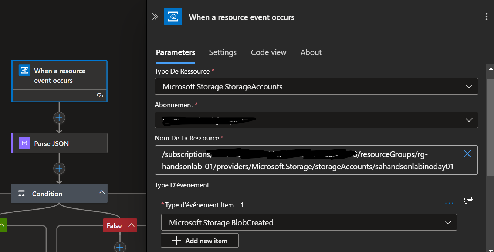
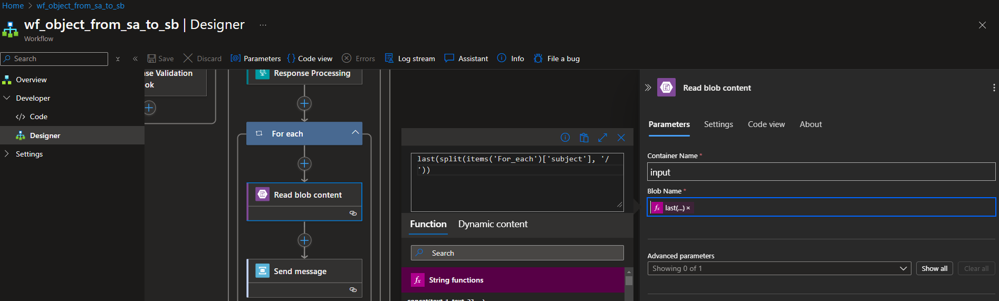

# 🚀 Lab 1 : Process and Transform a file (1 hour)

For this first lab, you will focus on the following scope :

## Detect a file upload event (15 min)

### Secure connections between Azure Services with Managed Identities

Managed Identities in Azure allow resources to authenticate securely to other Azure services. This feature eliminates the need to manage secrets or keys, reducing the risk of accidental exposure and simplifying maintenance. By enabling seamless and secure communication between resources, Managed Identities promote a stronger security model that relies on Azure's identity platform for authentication.

> You can find a detailed article which explains what are managed identities for Azure resources and how to use them [following this link](https://learn.microsoft.com/en-us/entra/identity/managed-identities-azure-resources/overview).

### Event Services

Serverless is all about designing the application around event-driven architectures. Azure offers several options when it comes to message and event brokering, with the principal following services :

- Event Grid is a serverless eventing bus that enables event-driven, reactive programming, using the publish-subscribe model.
- Service Bus is a fully managed enterprise message broker with message queues and publish/subscribe topics.
- Event Hub is a big data streaming platform and event ingestion service. It can receive and process millions of events per second.

> Each of these services offer their own set of capabilities and will be preferred depending on the expected architecture design and requirements. You can find a detailed article which compares the pros and cons of each of these solutions [following this link](https://learn.microsoft.com/en-us/azure/service-bus-messaging/compare-messaging-services).

Event Grid is an event broker that you can use to integrate applications while subscribing to event sources. These events are delivered through Event Grid to subscribers such as applications, Azure services, or any accessible endpoint. Azure services, First and Third-party SaaS services as well as custom applications can be the source of these events.

### 🚀 Check Logic App permission to access Event Grid

Event Grid enables event-driven automation by reacting to changes in Azure resources, such as triggering workflows or functions when a blob is uploaded to Azure Blob Storage.
This simplifies integration and real-time processing across services without constant polling.
You will use it to trigger the Logic App workflow `wf_flightbooking_from_sa_to_sb` when a blob is uploaded in the `input` container of the Storage Account.

The Logic App needs to access the Event Grid service through the Storage Account as it will create an Event Grid System Topic when the Event Grid trigger connector is created. Since we want to use Managed Identities to secure the connection between our Azure Resources, let's check how it is configured in the Storage Account.

> Check that correct RBAC configuration is applied in the Storage Account:
>- Navigate to the Storage Account `sahandsonlabinoday01`.
>- In the left-hand menu, click on `Access Control (IAM)`.
>- From the top-menu bar, click on Role Assignment and check that Logic App `loahandsonlabinoday01` has the **Event Grid Contributor** role.

You should see the following RBAC configuration in your Storage Account :

### 🚀 Check the Event Grid trigger in Logic App

Next step is to actually trigger the Logic App `loahandsonlabinoday01` based on the event raised by your Event Grid System Topic when a file is uploaded to the `input` container.

Azure Logic Apps offers different components which can be used to define the steps of a flow as a chain of actions and controls. Here are the main ones :

- **Operations** : Triggers and Actions are the main building blocks of a Logic App. A trigger is the event that starts the workflow and an action is a step in this workflow.
- **Controls** : Switch, Loop, Condition, Scope are used to control the flow of the steps composing the actual logic of the workflow.
- **Connectors** : Connectors are used to connect to different first of third party services and applications. These connectors abstract the complexities of interacting with these services by defining their required and optional inputs as well as deserializing their outputs to dynamic objects usable in the rest of the flow steps.

Since we want the Logic App to be triggered when an event is pushed from the Event Grid System Topic, we will be using the Event Grid Built-In connector available in Logic App.
It comes with one action "When a resource event occurs", that is triggered when an Azure Event Grid subscription fires an event.

> Check the configuration of the Event Grid trigger:
>- Navigate to the Logic App `loahandsonlabinoday01`.
>- In the left-hand menu, click on `Workflows` from the `Workflows` section.
>- Open the workflow `wf_flightbooking_from_sa_to_sb`.
>- In the left-hand menu, click on `Designer` from the `Developer` section.
>- Click on the trigger `When a resource event occurs`
>- Make sure that the Resource Id corresponds to your Storage Account where the file will be uploaded and that the Event type is **Microsoft.Storage.BlobCreated**

You should see the following configuration in your trigger :

### 🚀 Check the Event Grid subscription in the Event Grid System Topic

When we save the workflow for the first time, an Event Grid subscription will be created in the Storage Account automatically with some default naming convention, and it will be in 'Creating' state.
We will see in the next step why and how to validate the subscription.
In the meatime, let's have a look to the Event Grid subscription.

> Check the configuration of the Event Grid subscription in the Storage Account:
>- Navigate to the Storage Account `sahandsonlabinoday01`.
>- In the left-hand menu, click on Events.

You should see the following configurations in Event Grid Subscription :

> Check the configuration of the Event Grid subscription in the Storage Account:
>- Click on the name of the Subscription on the bottom of the page.

You should see the following configurations in Event Grid Subscription :

### 🚀 Check the Webhook validation condition

After the event is received, we add an action to parse the json event with the event grid schema. We can get the schema from [here](https://learn.microsoft.com/en-us/azure/event-grid/event-schema#event-schema).
The input to Parse JSON step is :

`@triggerBody()`

We add a condition step after, to check whether the event is a subscription Validation event or not. Condition is:

`"equals": [
          "@body('Parse_JSON')[0]?['eventType']",
          "Microsoft.EventGrid.SubscriptionValidationEvent"
        ]`

The reason we need to do this is to validate that our workflow is the correct subscriber to the events in the Storage Account. This is a security mechanism, to avoid untrusted subscribers to our Storage Account.  
Until we do not validate this event, the subscription will remain in the 'Creating' state.
To validate the event, we are using the Response action: `Response Validation Webhook`.

You should see the following configuration in your trigger :

## Process the event (5 min)

### 🚀 Check Logic App permission to access Storage Account

The Storage Account is used to store data objects, including blobs, file shares, queues, tables, and disks. In our lab, it is used to store the sample flight booking JSON file inside an `input` container.

The Logic App needs to access the Storage Account to retrieve the JSON file, and for the Event Grid trigger connector to list the available Storage Accounts in the Subscription.
Since we want to use Managed Identities to secure the connection between our Azure Resources, let's check how it is configured in the Storage Account.

> Check that correct RBAC configuration is applied in the Storage Account:
>- Navigate to the Storage Account `sahandsonlabinoday01`.
>- In the left-hand menu, click on `Access Control (IAM)`.
>- From the top-menu bar, click on Role Assignment and check that Logic App `loahandsonlabinoday01` has the **Storage Blob Data Contributor** role.

You should see the following RBAC configuration in your Storage Account :

### 🚀 Retrieve file content

To retrieve the content of the file that will be uploaded in the `input` container, we are using the `Azure Blob Storage` connector and `Read blob content` action.

> Check the configuration of the `Read blob content` action:
>- Navigate to the Logic App `loahandsonlabinoday01`.
>- In the left-hand menu, click on `Workflows` from the `Workflows` section.
>- Open the workflow `wf_flightbooking_from_sa_to_sb`.
>- In the left-hand menu, click on `Designer` from the `Developer` section.
>- Click on the action `Read blob content`.
>- Make sure that the Container Name is set to `input` and that the Blob Name is set to `last(split(items('For_each')['subject'], '/'))`.

You should see the following configuration in your action :

## Publish the message (10 min)

### Publish/Subscribe design pattern

The Publish/Subscribe (Pub/Sub) design pattern enables a decoupled communication model where publishers send messages to a central broker, and subscribers receive only the messages they are interested in, based on topics subscriptions.
This approach is well-suited for systems requiring loose coupling between components, such as event-driven architectures, when an application needs to broadcast information to multiple consumers, particularly if they operate independently, use different technologies, or have varying availability and response time requirements.

> You can find a detailed article which explains what is the Publisher-Subscriber design pattern and when to use it [following this link](https://learn.microsoft.com/en-us/azure/architecture/patterns/publisher-subscriber).

Azure Service Bus is a good solution for implementing the Publish/Subscribe pattern as it provides robust messaging capabilities, including topic-based subscriptions, reliable message delivery, and support for diverse protocols and platforms.
Its built-in features, such as message filtering, dead-letter queues, and transactional processing, make it ideal for building scalable, decoupled, and fault-tolerant systems.

### 🚀 Check Logic App permission to access Service Bus

The Logic App needs to access the Service Bus to publish the message (content of the file). Since we want to use Managed Identities to secure the connection between our Azure Resources, let's check how it is configured in the Service Bus.

> Check that correct RBAC configuration is applied in the Service Bus:
>- Navigate to the Service Bus `sbhandsonlabinoday01`.
>- In the left-hand menu, click on `Access Control (IAM)`.
>- From the top-menu bar, click on Role Assignment and check that Logic App `loahandsonlabinoday01` has the **Service Bus Data Receiver** and **Service Bus Data Sender** roles.

You should see the following RBAC configuration in your Service Bus Namespace :

### 🚀 Check the action to Publish the message to Service Bus

Next step is to publish the message (i.e. content of the file) in the Service Bus topic `topic-flighbooking`.
To do that, we are using the `Service Bus` connector and `Send message to a queue or topic` action.

> Check the configuration of the `Send message to a queue or topic` action:
>- Navigate to the Logic App `loahandsonlabinoday01`.
>- In the left-hand menu, click on `Workflows` from the `Workflows` section.
>- Open the workflow `wf_flightbooking_from_sa_to_sb`.
>- In the left-hand menu, click on `Designer` from the `Developer` section.
>- Click on the action `Send message`.
>- Make sure that the Container Name is set to `input` and that the Blob Name is set to `last(split(items('For_each')['subject'], '/'))`.

You should see the following configuration in your action :

At the end of this first section, we have a Logic App workflow that is triggered by an event when a new file is uploaded in the `input` container of our Storage Account, that reads the file content and publish it in a Service Bus topic.
The next section will focus on the subscription to this message and its processing, before sending it to the target system.

## Subscribe to the message (5 min)

Next step is to retrieve the message from the Service Bus in order to process it later. In the Pub/Sub pattern previously explained, this is the Subscription part.
We will build a workflow that will be triggered when a new message is available in the dedicated Service Bus subscription, containing our message.

### 🚀 Configure the Service Bus trigger in Logic App

In this step, will will configure the Logic App `Service Bus` connector and trigger `When messages are available in a topic`.
As the Service Bus connection configuration is already done, we will focus on the creation and configuration of the trigger itself.

> Create and configure the Service Bus trigger :
>- Navigate to the Logic App `loahandsonlabinoday01`.
>- In the left-hand menu, click on `Workflows` from the `Workflows` section.
>- Open the workflow `wf_flightbooking_from_sb_to_cdb`.
>- In the left-hand menu, click on `Designer` from the `Developer` section.
>- Click on the `Add a trigger` button.
>- In the triggers list search for `Service Bus` and select the `When messages are available in a topic` trigger.
>- In the Topic Name dropdown list, select the `topic-flighbooking` topic.
>- In the Subscription Name dropdown list, select the `sub-flighbooking-cdb` subscription.
>- Once everything is set, click on the Save button on the top left corner.

The trigger operation should look like this :

## Transform the message (10 min)

### Message Transformation

Message transformation in orchestration workflows is essential to ensure compatibility between systems that may use different data formats, structures, or conventions.
Target systems often have specific requirements for how data should be presented, such as field naming, value types, or schema validation.
Transformations also help enrich messages by adding necessary data or filtering out unnecessary information, optimizing the payload for the target system.
This step ensures seamless integration, reduces errors, and improves the reliability of communication across disparate systems.

In Logic Apps, you can transform messages using built-in connectors (e.g., JSON, XML, or flat file parsing), Liquid templates for complex JSON mapping, Data Mapper or Transform XML for complex XML mapping and Azure Functions or Inline Code for custom transformations.
Additionally, Logic Apps supports external tools like Azure API Management for preprocessing.
[Follow this link](https://learn.microsoft.com/en-us/azure/logic-apps/create-maps-data-transformation-visual-studio-code) for more details about message transformation in Logic Apps.

### 🚀 Configure the transform action in Logic App

We need to transform the initial message to a simplified format that is expected by the target system.
By consolidating passenger names into a list and focusing on key flight and payment details, we make the data more compact and easier for the target system to process.

This is the message expected by the target system:
`
{
    "transformedBooking": {
        "bookingId": "B12345678",
        "passengerNames": {
            "name": [
                "John Doe",
                "Jane Doe"
            ]
        },
        "flightDetails": {
            "flightNumber": "UA123",
            "departure": "SFO",
            "arrival": "JFK",
            "departureDate": "2022-02-15T08:00:00Z"
        },
        "payment": {
            "cardType": "Visa",
            "amountPaid": "500"
        }
    }
}
`
We need to transform the message from JSON to XML because XSLT is designed to operate on XML data.
Since XSLT requires XML as input to perform transformations, converting the JSON message into XML format allows us to leverage XSLTs powerful capabilities to manipulate and restructure the data as needed for the target system.

We will use a `Compose` action with a function to transform the JSON message into an XML format.

> Configure a `Compose` action with a function to transform JSON into XML:
>- Navigate to the Logic App `loahandsonlabinoday01`.
>- In the left-hand menu, click on `Workflows` from the `Workflows` section.
>- Open the workflow `wf_flightbooking_from_sb_to_cdb`.
>- In the left-hand menu, click on `Designer` from the `Developer` section.
>- Click on the `+` button, select `Add an action` and search for `Compose` from the list of actions.
>- In the Inputs field of the Compose action, enter the following function: `xml(json(triggerBody()?['contentData']))`.
>- Rename the action `JSON to XML`
>- Once everything is set, click on the Save button at the top left corner.

The Compose action should look like this :

We will then use a `Transform XML` action to transform the XML message into the desired output.

> Configure a `Transform XML` action using an XSLT file:
>- Click on the `+` button, select `Add an action` and search for `Transform XML` from the list of actions.
>- In the Content field, enter the following text: `outputs('JSON_to_XML')`.
>- In the Map Source dropdown list, select `LogicApp`.
>- In the Map Name dropdown list, select `transformation_flightbooking`.
>- Rename the action `Transform XML`
>- Once everything is set, click on the Save button at the top left corner.

The Transform XML action should look like this :

We will now use a `Compose` action with a function to transform the XML transformed message into a JSON format before sending it to the target.

> Configure a `Compose` action with a function to transform JSON into XML:
>- Click on the `+` button, select `Add an action` and search for `Compose` from the list of actions.
>- In the Inputs field of the Compose action, enter the following function: `json(body('Transform_XML'))`.
>- Rename the action `XML to JSON`
>- Once everything is set, click on the Save button at the top left corner.

The Compose action should look like this :

## Store the message in Cosmos DB (10 min)

Once the message has been transformed to match the format of the target system, we want to send it to our target system, in our case a container in CosmosDB, so that it can be processed later.
Azure Cosmos DB is a fully managed NoSQL database which offers Geo-redundancy and multi-region write capabilities.
It currently supports NoSQL, MongoDB, Cassandra, Gremlin, Table and PostgreSQL APIs and offers a serverless option which is perfect for our use case.

### 🚀 Retrieve Cosmos DB Shared Access Key

To use the Cosmos DB connector in our Logic App workflow and write to the Cosmos DB container, you can use the Shared Access Key for authentication.
This key grants the Logic App access to the Cosmos DB account and allows it to perform the required operations.
We will now see how to retrieve this key for integration into our configuration.

> Retrieve the Cosmos DB Shared Access Key:
>- Navigate to the Cosmos DB account `cdbhandsonlabinoday01`.
>- In the left-hand menu, click on Keys under the Settings section.
>- In the Keys section, locate the Primary Key.
>- Copy the Primary Key by clicking the copy icon next to it.
>- The key is now ready to be used in your Logic App configuration.

### 🚀 Store data to Cosmos DB

Now we can add the last step of the Logic App flow that will store the transformed message in the Cosmos DB database using the Create or update document V3 operation.
First, we need to configure the connection to our CosmosDB account.

> Configure the connection to CosmosDB for using the `Create or update document (V3)` connector:
>- Navigate to the Logic App `loahandsonlabinoday01`.
>- In the left-hand menu, click on `Workflows` from the `Workflows` section.
>- Open the workflow `wf_flightbooking_from_sb_to_cdb`.
>- In the left-hand menu, click on `Designer` from the `Developer` section.
>- Click on the `+` button, select `Add an action` and search for `Cosmos DB`.
>- Select `Create or update document (V3)`
>- Set the connection with your Cosmos Db Instance: Select the Access Key authentication type and set the primary key that you retrieved in the previous step

The configuration should look like that:

Once the connection is set-up, we can configure the action.
Before creating the document in Cosmos DB, we need to add a unique `id` property to the document, as it is mandatory.
We will use a `Compose` action to generate a unique identifier and append an `id` property to our message.

> Configure a `Compose` action to generate a UUID and append the id property:
>- Click on the `+` button, select `Add an action` and search for `Compose`.
>- In the Inputs textbox, click on the `fx` icon and enter the following text : `addProperty(outputs('XML_to_JSON'), 'id', guid())`
>- Rename the action `Append id property and generate UUID`
>- Once everything is set, click on the Save button on the top left corner.

The Compose action should look like this :

We are now ready to send our message to our CosmosDB account.  
To do so, we need to configure our `Create or update document (V3)` connector.

> Configure the `Create or update document (V3)` action to create a new document in CosmosDB:
>- In the Database Id textbox, enter the following text : `handsonlab`
>- In the Container Id textbox, enter the following text : `items`
>- In the Item textbox, click on the `lightning` button and select `Outputs` from the previous action `Append id property and generate UUID`
>- Once everything is set, click on the Save button on the top left corner.

The action should look like this :

## Trigger the workflow (5 min)

We are now ready to test our workflow.

### 🚀 Check the message stored in the CosmosDB

First, let's upload a new file to the `flightbookings` container of the `cdbhandsonlabinoday01` Storage Account to simulate a booking.
You can download the JSON file from here: [Download sample JSON file](assets/sample_flightbooking.json)

> Upload the file in the Storage Account :
>- Navigate to the Storage Account `sahandsonlabinoday01`.
>- In the left-hand menu, click on `Storage browser` and select `Blob containers`.
>- Click on the `input` container.
>- From the top-menu bar, click on the `Upload` button, click on `Browse for files` and select the `sample_flightbooking.json` file from your Storage Explorer.
>- Click on the `Upload` button below.

You should see your file in the container:

Finally, let's check if our message is stored in our CosmosDB container.

> Check the document created in CosmosDB 
>- Navigate to the Cosmos DB account `cdbhandsonlabinoday01`.
>- In the left-hand menu, click on `Data explorer` and click on `handsonlab` to open the database
>- Click on `flightbookings` to open the container
>- Click on `Items` and select the first line

You should see your transformed message in the `flightbookings` container:

